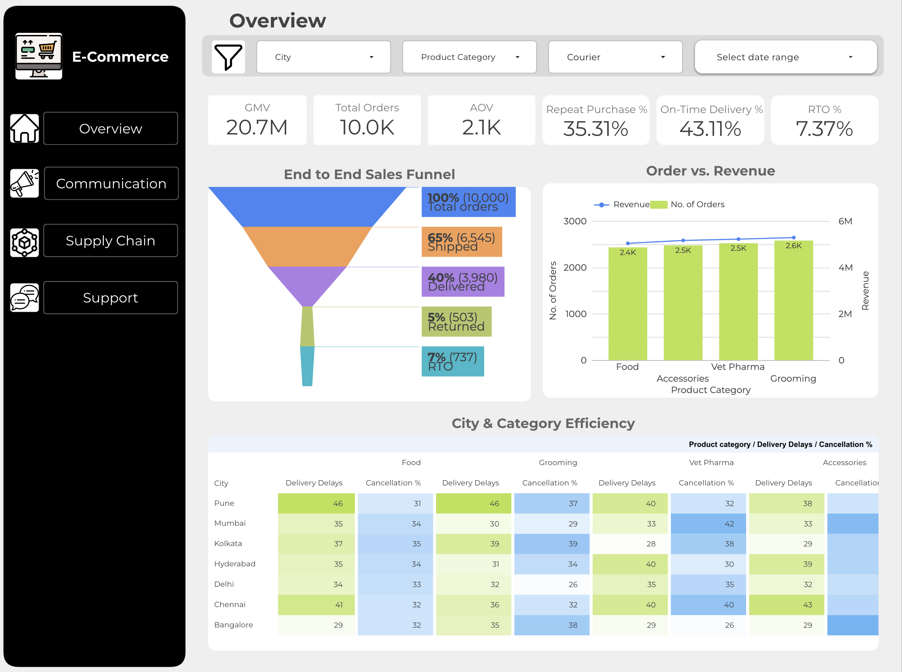

# End-to-End-E-Commerce-Performance 🚀
End-to-end analysis of E-Commerce Performance, including SQL extraction, Python predictive modeling, and Looker Studio dashboarding.

## 📊 Project Overview
This project is an end-to-end data analytics solution designed to optimize operations for a high-growth D2C (Direct-to-Consumer) pet care retailer. The analysis covers the entire data value chain: from raw data extraction using SQL, to predictive modeling in Python, and finally, executive-level reporting in Looker Studio.

**Key Business Goals:**
* Reduce **Return to Origin (RTO)** rates by analyzing supply chain bottlenecks.
* Improve **Customer Retention** via RFM Segmentation.
* Enhance **Support Efficiency** by predicting ticket volume.

---

## 📈 Interactive Dashboard
Don't just read about it—explore the data yourself.

> **[Click here to view the Live Interactive Dashboard](https://lookerstudio.google.com/reporting/b04d3bdd-f705-42be-b69b-e109328bb0e0)**

---

## 🛠️ Tech Stack & Workflow

| Stage | Tools Used | Key Activities |
| :--- | :--- | :--- |
| **Data Extraction** | **SQL (MySQL/SparkSQL)** | Cohort analysis, O2C (Order-to-Connect) rates, Vet consultation lag times. |
| **Data Processing** | **Python (Pandas, NumPy)** | Cleaning 5+ relational tables, FK validation, Timestamp logic checks. |
| **Analytics & ML** | **Scikit-Learn, Seaborn** | RFM Segmentation, Churn Prediction (Logistic Regression). |
| **Visualization** | **Google Looker Studio** | Interactive filters, Geo-heatmaps, Funnel analysis. |

---

## 🧠 Key Insights & Methodology

### 1. Supply Chain Optimization 🚚
* **Problem:** High delivery gaps causing cancellations.
* **Approach:** Calculated `promised_delivery_date` vs `actual_delivery_date` gaps.
* **Finding:** Orders shipped via "Courier Partner X" had a 15% higher average TAT, correlating with a 4% higher RTO rate.

### 2. Customer Segmentation (RFM) 👥
* **Bronze Cluster:** Low frequency, low monetary value. (Action: Target with discount coupons).
* **Gold Cluster:** High frequency, high value. (Action: Early access to new sales).
* **At-Risk:** High past value, but no recent purchase. (Action: Reactivation campaigns).

### 3. Predictive Modeling 🤖
* **Objective:** Predict if a customer will raise a support ticket.
* **Model:** Logistic Regression.
* **Top Feature:** `courier_delay_flag` was the strongest predictor of support tickets.

---
